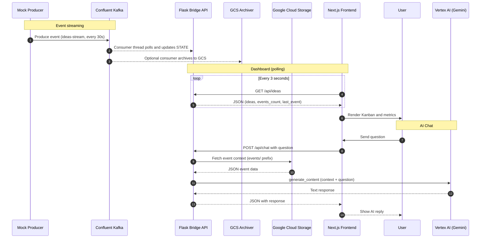
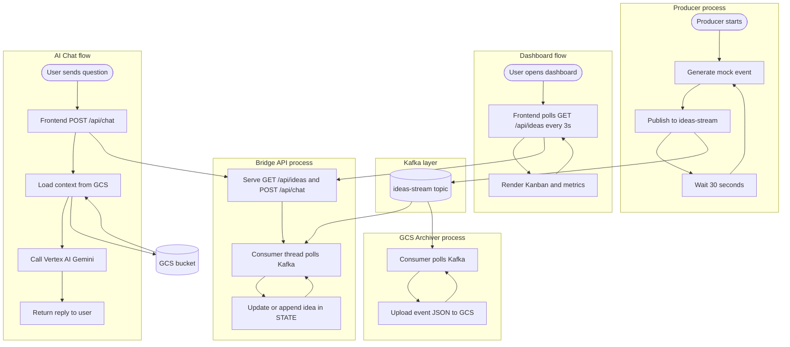

# Idea Bank – Architecture Diagrams

This document describes the end-to-end flow of the Idea Bank platform using a sequence diagram and a process flowchart.

---

## 1. Sequence diagram

## High-level flow

## Diagram legend

| Participant | Description |
|------------|-------------|
| **Mock Producer** | Python script (`producer.py`) that generates Epics/Features/Issues events and publishes to Kafka. |
| **Confluent Kafka** | Topic `ideas-stream`; events are consumed by the Bridge and optionally by the GCS Archiver. |
| **Flask Bridge API** | `app.py`: runs a Kafka consumer in a background thread (updates in-memory STATE) and serves REST endpoints. |
| **GCS Archiver** | Optional process `consumer_storage.py` that consumes from Kafka and uploads each event to GCS. |
| **Google Cloud Storage** | Stores archived events under `events/`; the chat engine reads this as context for Gemini. |
| **Next.js Frontend** | Polls `/api/ideas` for the dashboard; sends questions to `/api/chat` for the AI assistant. |
| **Vertex AI (Gemini)** | RAG-style chat: context from GCS + user question → Gemini → plain-text answer. |

## 2. Process flow (flowchart)

The flowchart below shows the main process flows: event streaming, dashboard updates, and AI chat.

### Flowchart summary

| Flow | Description |
|------|-------------|
| **Producer** | Loops: generate event → publish to Kafka → wait 30s. |
| **Bridge** | Background consumer updates in-memory STATE from Kafka; HTTP server serves dashboard and chat. |
| **GCS Archiver** | Optional process that consumes from Kafka and uploads each event to GCS. |
| **Dashboard** | Frontend repeatedly polls `/api/ideas` and re-renders the board and metrics. |
| **AI Chat** | User question → Bridge loads context from GCS → Gemini generates answer → Bridge returns text to frontend. |

---

## Diagram legend (sequence diagram)

| Participant | Description |
|------------|-------------|
| **Mock Producer** | Python script (`producer.py`) that generates Epics/Features/Issues events and publishes to Kafka. |
| **Confluent Kafka** | Topic `ideas-stream`; events are consumed by the Bridge and optionally by the GCS Archiver. |
| **Flask Bridge API** | `app.py`: runs a Kafka consumer in a background thread (updates in-memory STATE) and serves REST endpoints. |
| **GCS Archiver** | Optional process `consumer_storage.py` that consumes from Kafka and uploads each event to GCS. |
| **Google Cloud Storage** | Stores archived events under `events/`; the chat engine reads this as context for Gemini. |
| **Next.js Frontend** | Polls `/api/ideas` for the dashboard; sends questions to `/api/chat` for the AI assistant. |
| **Vertex AI (Gemini)** | RAG-style chat: context from GCS + user question → Gemini → plain-text answer. |

## Data flow summary

1. **Streaming**: Producer → Kafka → Bridge (STATE) and optionally → GCS Archiver → GCS.
2. **Dashboard**: Frontend polls Bridge; Bridge returns current STATE (no direct Kafka from browser).
3. **Chat**: Frontend → Bridge → chat engine loads context from GCS and calls Vertex AI; Bridge returns the model reply to the frontend.
